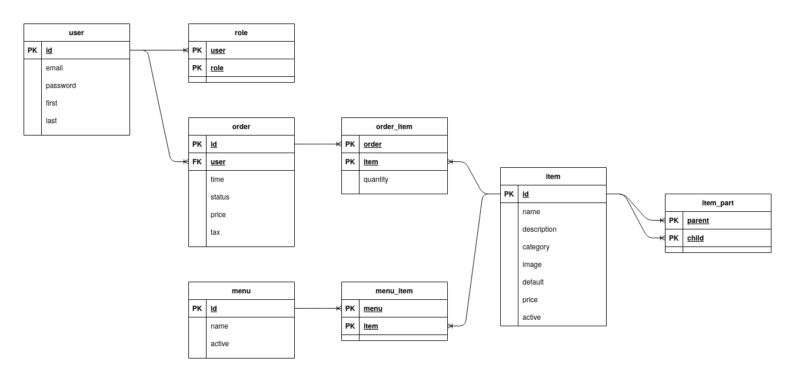

# ACSG-545-Restaurant

## Installation
Install [Node.js](https://nodejs.org/en/) 14.15.4 LTS.

Then,

```
# install packages
npm install

# create/upgrade database
./node_modules/.bin/migrate
```

Run local app server.
The DEBUG environment variable is optional.

```
# MacOS/Linux
DEBUG=acsg-545-restaurant:* npm start
# Windows
set DEBUG=acsg-545-restaurant:* & npm start
```

Then, navigate to [localhost:8080](localhost:8080).

## Contributing
### Style
Use [Javascript Standard Style](https://standardjs.com/).
In the project directory, run the following to check the style on-demand:

```
./node_modules/.bin/standard
```

Install the git pre-commit hook for automatic checking before a commit:

```
ln -s ../../tools/pre-commit .git/hooks/pre-commit
```

### Database
[node-migrate](https://github.com/tj/node-migrate)
is used for versioning the database.

To create a new migration, run

```
./node_modules/.bin/migrate create
```

The command creates a new file in ./migrations,
where the up and down migrations can be configured.
See the documentation for more details.
When creating a migration, update the ERD in ./doc.

Each time the database is updated, you must run the new migrations:

```
# create/upgrade database
./node_modules/.bin/migrate
```

The ERD is below:


